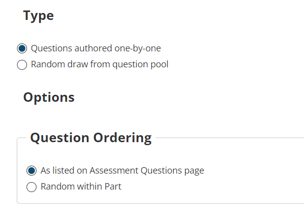
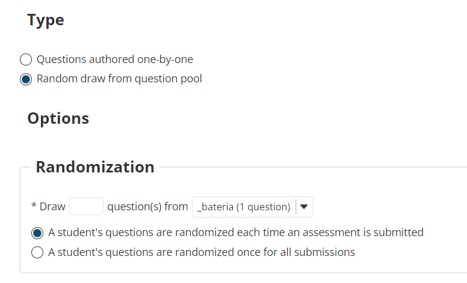
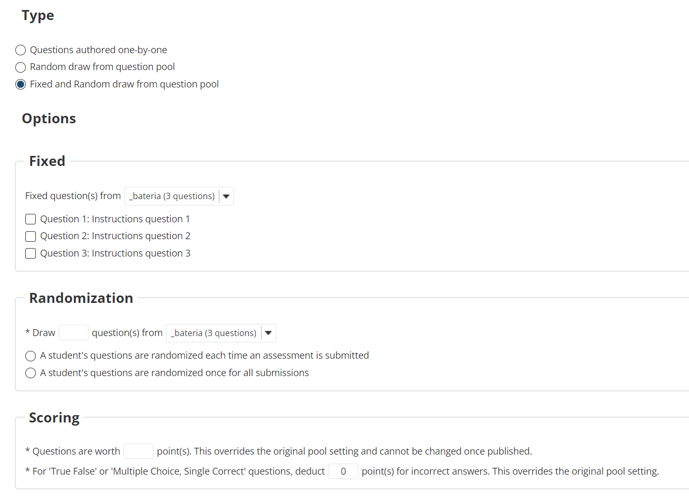

# New option to use fixed questions and random questions from question pools on a part

## Option 1 - Questions authored one-by-one

## Option 2 - Random draw from question pool

## Option 3 - Fixed and randow from question pool

New development

