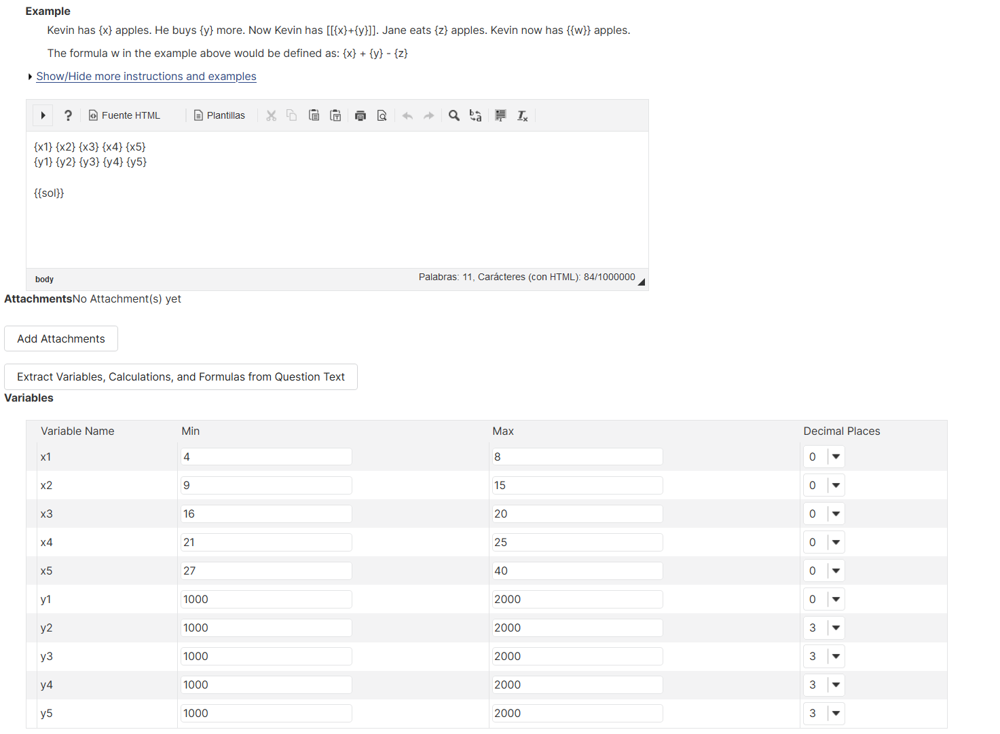
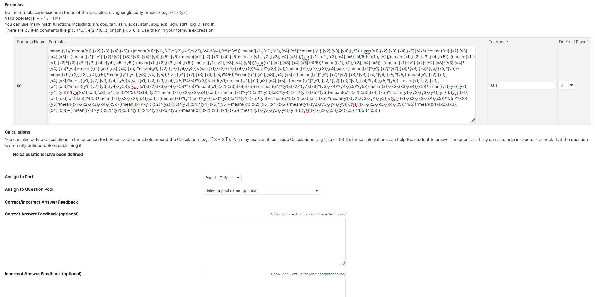
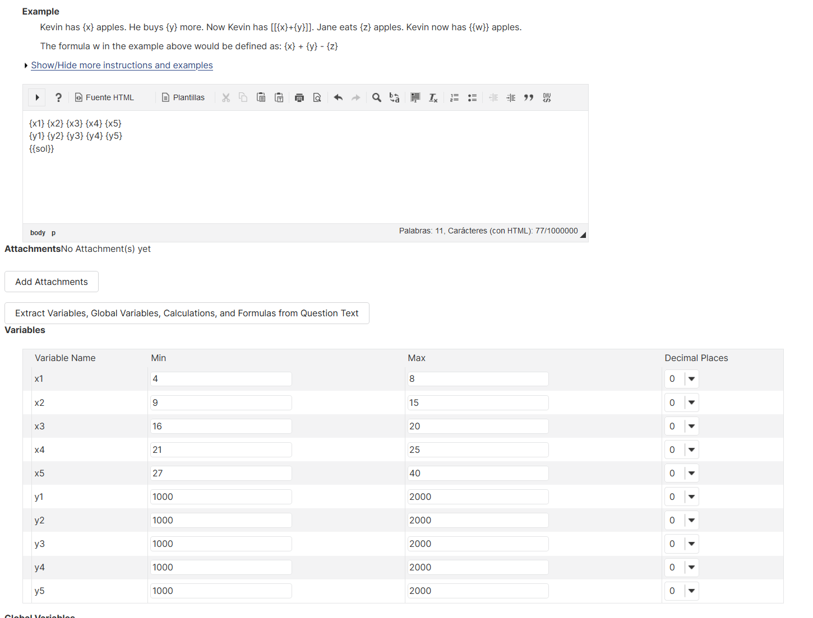
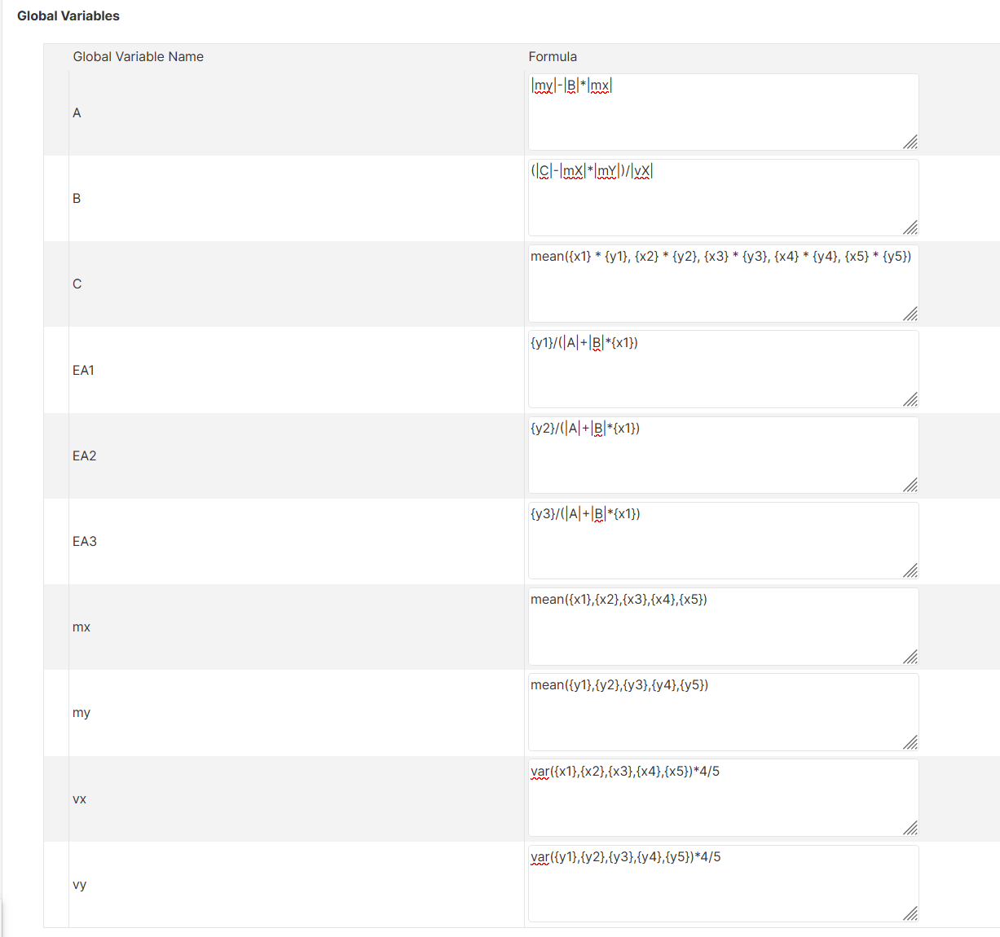
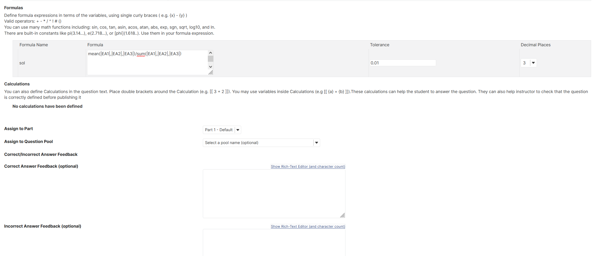

# Global variables in calculated question

## Creating a calculated question (this is still supported)

As you can see the solution field is very large and it is easy to make mistakes when entering it.

## Creating a calculated question with global variables

You can create global variables which can be used in instructions, in other global variables, in solution and in correct/incorrect feedback

The formula for the solution is reduced to the minimum expression

Pipes delimiters ("|") will be changed to at delimiters ("@")