# Improving i18n and feedback on calculated question

## Writing calculated question

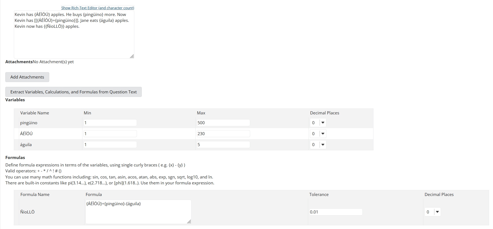

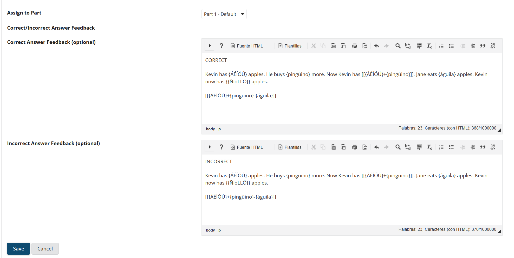

## Saved calculated question

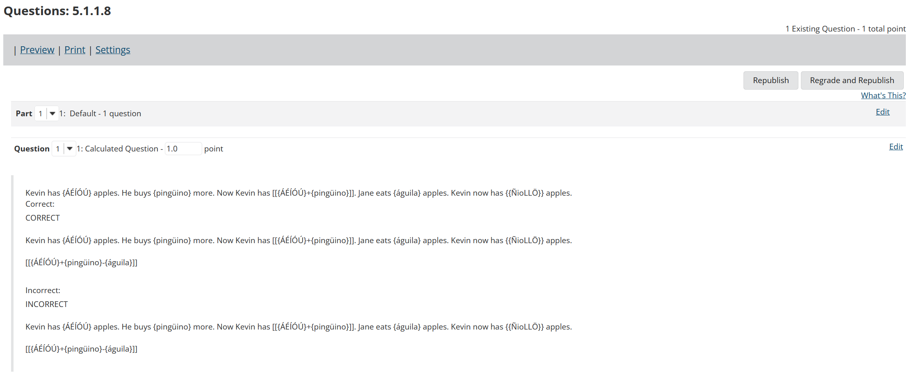

## Preview assessment

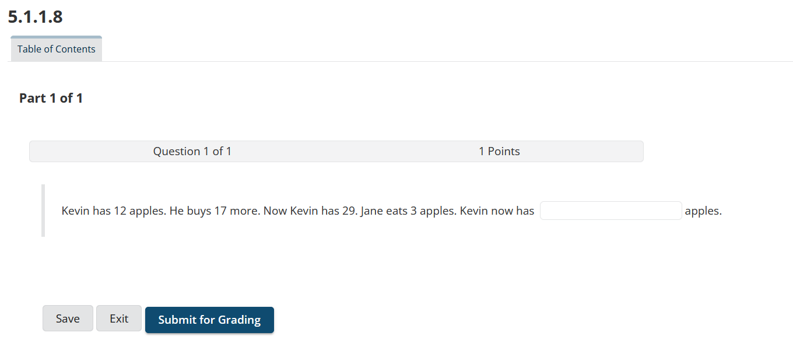

## Print assessment

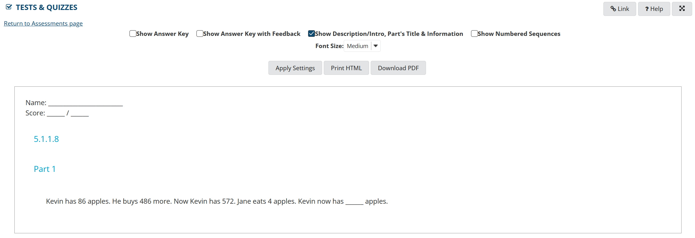

## Student doing assessment

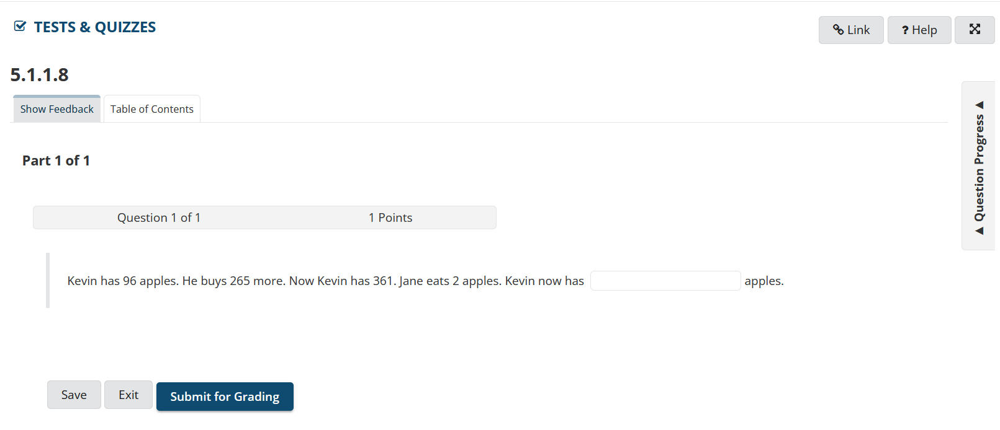

## Student preview solution

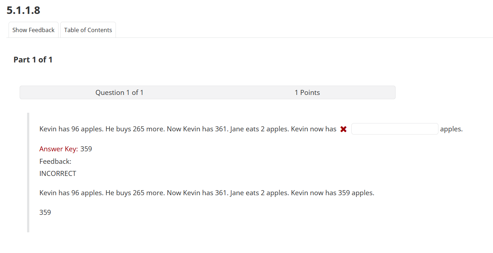

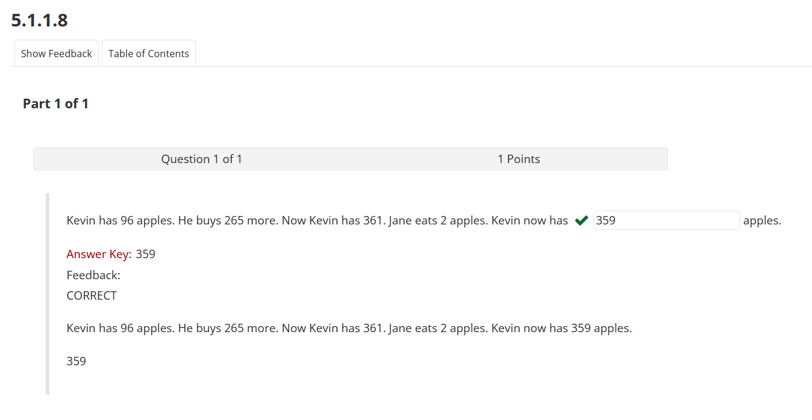

## Total scores

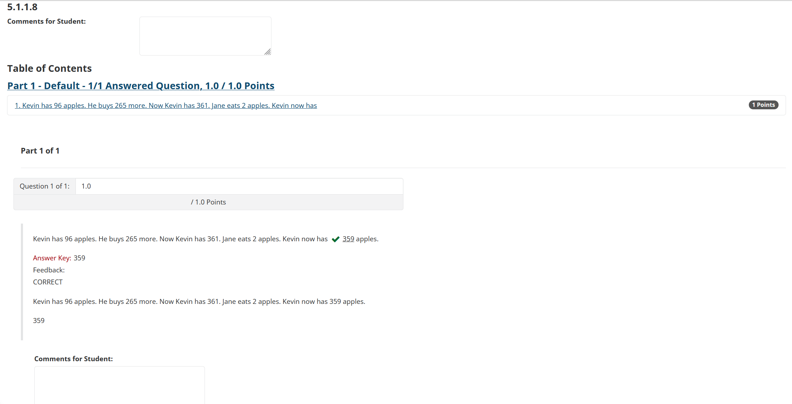

## Score by question

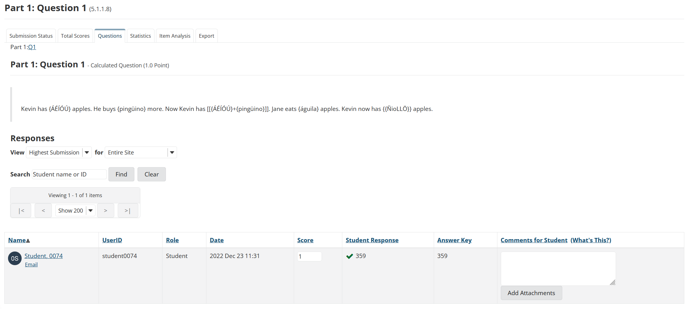

## Statistics

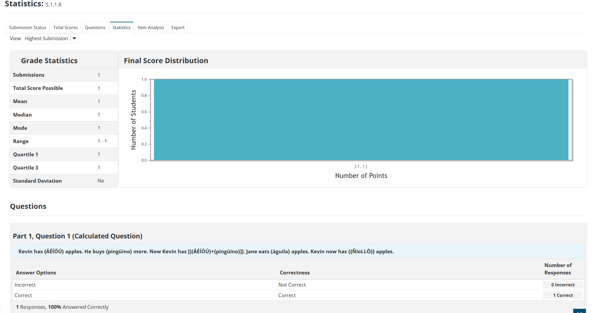

## Student checking feedback

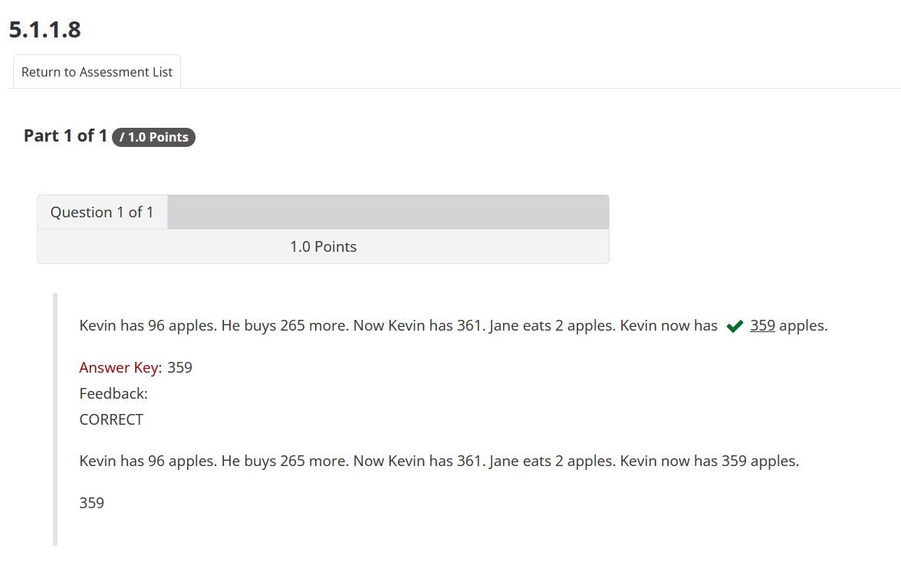